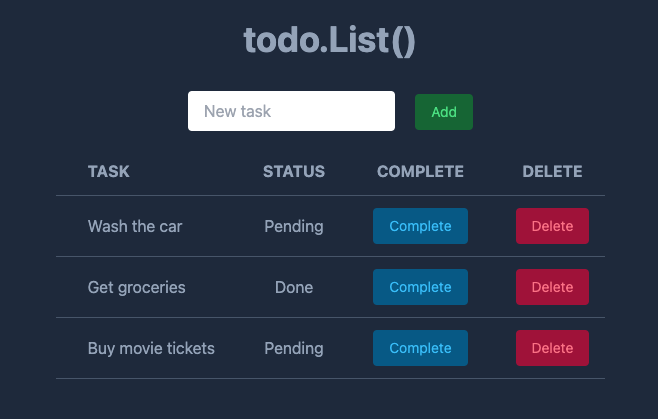

# todo.List()

This is a simple todo list app written in Go using [Templ](https://github.com/a-h/templ) and [HTMX](https://htmx.org/).  I used [Tailwind](https://tailwindcss.com/) for styling.

I made this app as an exercise for learning Templ and HTMX with server-side rendering.
